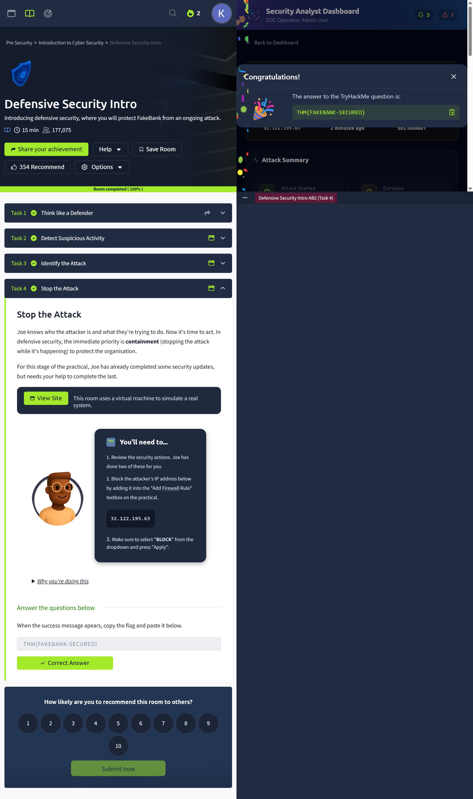

# 📅 Daily Progress Log | Day 02 - april 30, 2026

## 🎯 Quick Overview
- **Primary Focus:** Defensive Security Operations & Real-world Breach Analysis
- **Status:** ✅ 100% Completed (Defensive Lab) | ⏳ 60% (Security Engineering)
- **Current Streak:** 2 Days 🔥

---

## 🧪 TryHackMe Lab: [Defensive Security Intro](https://tryhackme.com/room/defensivesecurityintro)

### 📊 Lab Metrics
* **Role:** SOC Analyst
* **Target:** FakeBank Infrastructure
* **Objective:** Detect and mitigate a live brute-force attack.

### 🛠️ Execution & Methodology
1. **Detection:** Monitored server logs and identified a massive spike in failed login attempts.
2. **Analysis:** Pinpointed the attacker's source IP: `32.122.195.63`.
3. **Response:** Implemented a firewall rule to block all traffic from the malicious IP.
4. **Resolution:** Successfully secured the bank's database and retrieved the flag.

**Flag:** `THM{FAKEBANK-SECURED}`

### 📸 Evidence (Asset)

---

## 🔍 Case Study: [Tamil Nadu Labour Department Breach (2024)](https://github.com/kumar428/cybersecurity-portfolio)

### 🚨 Incident Summary
* **Scale:** 7.2 Million records compromised.
* **Impact:** Leak of PII data (Aadhaar, PAN, Bank Details) of migrant workers.
* **Attack Vector:** **GSocket (Global Socket)** used for Reverse Tunneling.

### 🛡️ Critical Technical Analysis
* **The GSocket Factor:** It bypassed **NAT** and **Firewalls** by initiating outbound connections which are often trusted.
* **MFA Failure:** Absence of Multi-Factor Authentication allowed attackers to gain 'root' access easily.
* **Lesson Learned:** The "Installation" phase of the first breach wasn't cleaned, leading to a second hit in November 2024.

### 💡 Remediation Strategy
- [ ] **Zero Trust:** Enforce MFA for all administrative logins.
- [ ] **Egress Filtering:** Block unauthorized P2P/Tunneling protocols at the network edge.
- [ ] **Encryption:** Encrypt sensitive citizen data "at rest."

---

## 🚀 Tomorrow's Plan (Day 03)
* [ ] Complete **Experience Cyber Security** (Task 4 & 5).
* [ ] Run `stage3.py` automation script for Security Engineering.
* [ ] Start **Section 2: Introduction to Pentesting**.

---
*Generated as part of FITA Academy - Cybersecurity Professional Course.*
