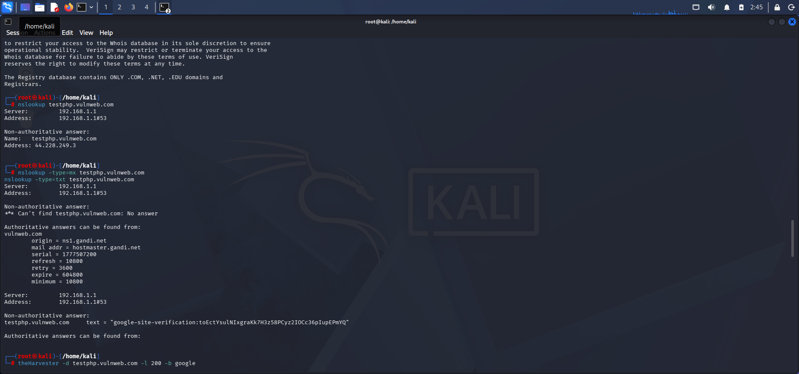

# Mini Penetration Test Report : Footprinting

## Objective
To perform footprinting (passive and active) on testphp.vulnweb.com to map its attack surface.

## Tools Used
- whois
- nslookup
- theHarvester
- Shodan (web UI)

## Findings

### Whois Lookup
- Registrar: Xxx
- Name Servers: ns1.example.com, ns2...
- Creation Date: ...

### DNS Queries (nslookup)
- A record: 104.18.22.190
- MX record: not found
- TXT record: none

### theHarvester
- Subdomains found: www, demo, ...
- Emails: (list)

### Shodan
- IP 104.18.22.190 shows services: HTTP 80, 443
- Organization: Cloudflare (no direct backend visible)
- 

## Countermeasures
- Redact sensitive info from Whois (registrar privacy)
- Avoid exposing internal subdomains in public DNS
- Use CDN/WAF effectively to hide backend IP
