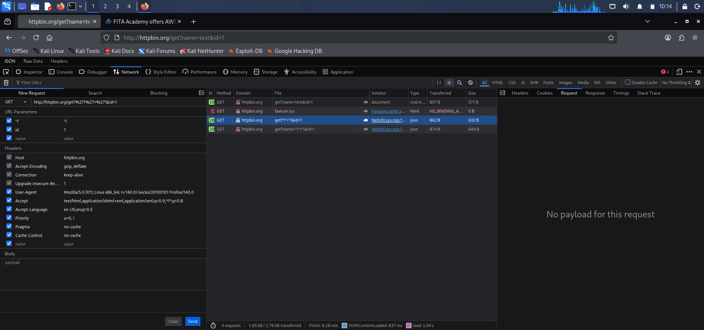
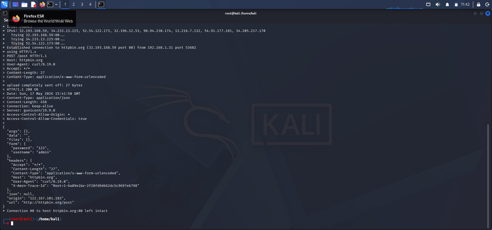

# 🌐 Web Application 

📍 **Environment:** Browser DevTools + curl on Kali and test site  
🛠️ **Tools:** Chrome DevTools (Network, Application, Sources), curl, URL encoder

---

## 🎯 What I Did Today

### 1. HTTP Request/Response Deep Dive
- Broke down the anatomy of an HTTP request: method (GET/POST), path, headers (Host, User-Agent, Cookie), and body.
- Analysed live traffic using the **Network tab** – inspected request/response headers, status codes, and payloads.

### 2. Cookies & Session Security
- Used the **Application tab** to view, edit, and delete cookies.
- Identified missing security flags: `HttpOnly`, `Secure`, `SameSite` – classic findings in real pentests.

### 3. Request Replay & Manipulation
- Used **Edit and Resend** to modify parameters and observe server response.
- Tested parameter tampering, IDOR-like behavior, and basic input reflection.

### 4. curl for Header & Method Testing
- Ran `curl -v http://testsite` to view full headers.
- Sent custom headers with `-H` and tested methods with `-X`.

### 5. Source Code & Sensitive Data
- Inspected page source with **View Page Source** and DevTools **Sources**.
- Hunted for comments, hidden fields, API keys, and debug parameters.

### 6. URL Encoding
- Practiced encoding special characters (`%20`, `%27`, `%3C`) to understand how filters are bypassed in injection attacks.

---

## 🧠 Key Takeaways

| Concept | Insight | VAPT Relevance |
|---------|--------|----------------|
| **HTTP structure** | Requests have method, path, headers, body | Understanding this is essential for any web attack |
| **Cookies** | Session state, can be tampered or stolen | Missing `Secure`/`HttpOnly` flags lead to session hijacking |
| **Edit & Resend** | Quickly replay requests with modified parameters | Ideal for IDOR, privilege escalation, and input fuzzing |
| **curl** | Scriptable, repeatable HTTP testing | First tool in any API or web pentest |
| **Source inspection** | Hidden comments, keys, endpoints | Gold mine for information disclosure findings |
| **URL encoding** | Bypass filters, craft payloads | Fundamental for XSS, SQLi, command injection |

> 💡 **Core lesson:** The browser is a pentester's first proxy. DevTools lets you manipulate everything the user controls – and everything the server trusts.

---
## 📸 Proof of Work

| Screenshot | Description |
|:---|:---|
|  | **Image 1:** Analyzing HTTP traffic and network requests in Browser DevTools |
|  | **Image 2:** Modifying and resending network requests to test endpoints |
|  | **Image 3:** Inspecting POST request payloads and form data submissions |
|  | **Image 4:** Reviewing active session cookies and security attributes (Secure/HttpOnly) |
|  | **Image 5:** Generating and executing `curl` commands from the terminal |
|  | **Image 6:** Analyzing custom HTTP header injections using `curl -H` |
