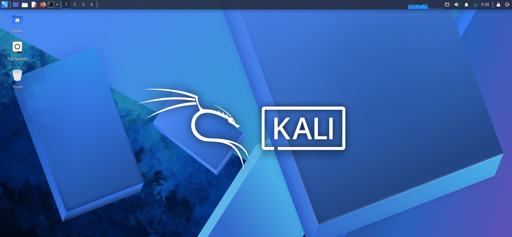
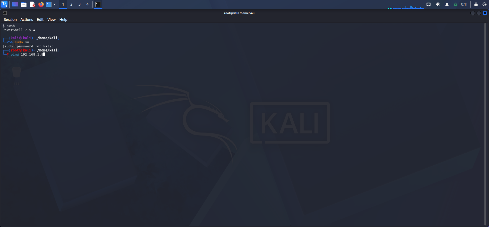
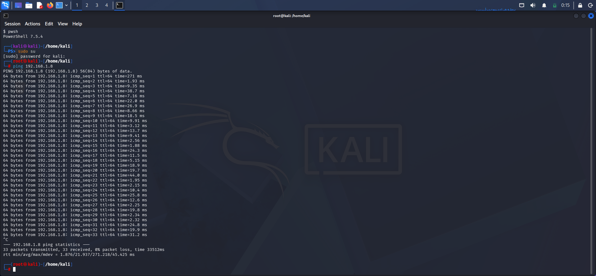

# Ethical Hacking Lab Setup – VirtualBox, Kali Linux & Metasploitable2

**Author:** kumar palanivelu  
**Date:** 03 May 2026  
**Project ID:** MP-01

## 🎯 Objective
To set up a personal penetration testing lab with Kali Linux (attacker) and Metasploitable2 (victim) on VirtualBox, ensuring proper network connectivity.

## 🛠️ Lab Architecture
| Component | Description |
|-----------|-------------|
| Hypervisor | VirtualBox 7.x |
| Attacker | Kali Linux (latest) |
| Victim | Metasploitable2 |
| Network | NAT Network / Host-Only (same subnet) |

## 🔧 Setup Steps

### Step 1: Kali Linux Installed & Running
*(Insert screenshot: VirtualBox showing Kali powered on)*  

### Step 2: Kali Terminal Access
*(Insert screenshot: Kali terminal with prompt)*  

### Step 3: Metasploitable2 Running & IP Discovery
Logged in as `msfadmin:msfadmin`, ran `ip a` → IP: `192.168.1.8`  
*(Insert screenshot: Metasploitable terminal showing IP)*  

### Step 4: Network Connectivity Verification
Ping test from Kali to Metasploitable:
ping 192.168.1.8

text
64 bytes replies received – Network functional.  
*(Insert screenshot: Ping output)*  

### Step 5: Initial Nmap Scan
nmap -sV -F --min-rate 1000 -T3 192.168.1.8

text
Discovered 18 open ports, confirming full connectivity and service enumeration capability.  
*(Insert screenshot: Nmap output)*  

## ✅ Conclusion
The lab is fully operational. Both machines are on the same network and ready for advanced scanning, exploitation, and reporting exercises.

---
*Part of my Ethical Hacking Portfolio. Next: AI-assisted vulnerability analysis.*
